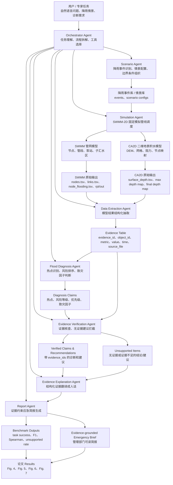
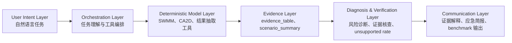

# SWMM-2D-Agentic 论文 Agent 协同工作逻辑图与说明

本文档用于支撑论文方法部分中的 **SWMM-2D-Agentic architecture**、**Agent roles and tool interfaces** 与 **evidence-grounded diagnosis workflow**。核心思想是：LLM-Agent 不替代 SWMM、CA2D 或确定性 Python 程序，而是作为任务编排、结果解释和证据约束层，把复杂城市内涝模拟从“模型执行任务”推进为“可追踪的决策支持工作流”。

## 1. 总体协同逻辑图



## 2. 核心工作链条

论文中的 Agent 协同可以概括为一条闭环链：

```text
自然语言任务
-> Orchestrator 任务编排
-> Scenario 情景组织
-> Simulation 模型运行
-> Extraction 证据抽取
-> Diagnosis 风险诊断
-> Verification 证据核查
-> Explanation 证据解释
-> Report 简报生成
-> Benchmark 量化评价
```

这条链条的关键不在于 LLM 能不能“说人话控制 SWMM”，而在于它是否能把多个确定性工具和工程判断步骤组织成一个可执行、可追踪、可评价的工作流。

## 3. 各 Agent 的职责边界

| Agent | 核心职责 | 输入 | 输出 | 是否应由 LLM 自由发挥 |
|---|---|---|---|---|
| Orchestrator Agent | 理解用户任务，拆解工作流，选择工具和下游 Agent | 用户自然语言任务、项目上下文 | 执行计划、工具调用顺序 | 可以，但必须受工具边界约束 |
| Scenario Agent | 识别降雨事件、重现期、情景参数和边界条件 | 用户任务、降雨库、情景库 | 标准化 scenario 配置 | 少量 LLM，可由规则和 schema 约束 |
| Simulation Agent | 调用 SWMM 和 CA2D 固定模拟管线 | scenario 配置、SWMM 模型、CA2D 静态模型 | run 目录、summary.json、模型输出 | 不应自由发挥，应 tool-first |
| Data Extraction Agent | 从模型输出抽取关键指标 | nodes、links、node_flooding、surface_depth、rpt/out | evidence_table.csv、scenario_summary.json | 不应自由发挥，应确定性程序 |
| Flood Diagnosis Agent | 根据证据识别热点、风险等级和致灾因子 | evidence_table.csv、诊断规则 | diagnosis_claims.json、risk_ranking.csv | 初期应规则优先，LLM 只辅助解释 |
| Evidence Verification Agent | 检查诊断和建议是否有证据支撑 | claims、recommendations、evidence_table | verification_report.json、unsupported rate | 不应自由发挥，应规则核查 |
| Evidence Explanation Agent | 把结构化证据解释成人能读懂的话 | 工具输出、验证结果、诊断证据 | 证据保留式自然语言解释 | 可以表达，但不能新增事实 |
| Report Agent | 生成面向管理部门或论文的结构化报告 | verified claims、证据解释、图表 | emergency_brief.md/html、论文案例材料 | 可以组织语言，但必须引用证据 |

## 4. Flood Diagnosis Agent 的位置

Flood Diagnosis Agent 是从“模型输出”到“内涝诊断”的关键转换层。SWMM 和 CA2D 原始输出本身不会直接告诉用户哪里最危险、为什么危险、是否应优先处置。它们只提供大量数值结果。

Flood Diagnosis Agent 要做的是：

1. 从节点溢流证据中识别关键溢流节点。
2. 从管段状态证据中识别高负荷或瓶颈管段。
3. 从二维积水证据中识别最大积水深度热点。
4. 从时间序列中识别长持续积水热点。
5. 综合溢流、管段、地表积水等证据，给出风险等级。
6. 给出初步致灾因子判断，例如上游节点持续溢流、下游管段高负荷、局部低洼积水、管网-地表叠加风险等。

它的输出不能只是自然语言段落，而应是结构化诊断对象，例如：

```json
{
  "claim_id": "claim_001",
  "claim_type": "hotspot_detection",
  "object_type": "surface_cell_or_zone",
  "object_id": "zone_A3",
  "risk_level": "High",
  "priority": 1,
  "diagnosis": "该区域为本场降雨下的高风险积水热点。",
  "driving_factors": [
    "long-duration surface ponding",
    "upstream node flooding"
  ],
  "evidence_ids": [
    "ev_depth_0001",
    "ev_duration_0008",
    "ev_node_flooding_0032"
  ]
}
```

因此，Flood Diagnosis Agent 的价值不是“替代水动力计算”，而是把水动力模型输出转化为可解释、可排序、可用于应急响应的诊断结论。

## 5. Evidence Verification Agent 的位置

Evidence Verification Agent 是防止 LLM 幻觉和无证据建议的审查层。它不负责提出诊断，也不负责写漂亮报告，而是检查每条诊断和建议是否被模型证据支撑。

它需要检查：

1. 每条诊断是否带有 `evidence_ids`。
2. 每条建议是否带有 `evidence_ids`。
3. 引用的 evidence id 是否真实存在于 `evidence_table.csv`。
4. 引用证据的对象是否与结论对象一致。
5. 引用证据是否达到风险阈值。
6. 没有证据或证据不足的建议是否被标记为 unsupported。

核心评价指标是：

```text
unsupported recommendation rate =
无有效证据支撑的建议数 / 建议总数
```

这个 Agent 是论文可信性设计的关键。它让系统从“看起来会分析”变成“每条分析都能回溯证据”。

## 6. Evidence Explanation Agent 与 Web 中两个解释 Agent 的关系

当前 `web_app.py` 中已经有两个解释层 Agent：

1. `EvidenceExplainer`
2. `SimulationEvidenceExplainer`

它们本质上属于同一类：**Evidence Explanation Agent**。

它们共同完成的任务是：

```text
结构化工具输出 -> 受证据约束的自然语言解释
```

区别只是解释对象不同：

- `EvidenceExplainer` 解释固定验证器结果，例如模型项目是否完整、CA2D 静态模型是否齐全、降雨事件是否存在。
- `SimulationEvidenceExplainer` 解释固定模拟管线结果，例如 run_id、输出目录、SWMM 步数、节点数、管段数、最大水深、结果文件路径。

后续可以将二者合并为一个通用的 `EvidenceExplanationAgent`，通过 `evidence_type` 区分：

```text
validation
simulation
diagnosis
verification
benchmark
report
```

需要注意的是，Evidence Explanation Agent 只是翻译员，不是审查员。它可以解释已有证据，但不能替代 Evidence Verification Agent 去判断建议是否有证据。

## 7. 与当前 SWMM_Agentic 代码的对应关系

当前代码中已经实现或部分实现的 Agent 包括：

| 当前代码对象 | 位置 | 论文架构中的对应角色 | 当前成熟度 |
|---|---|---|---|
| `Orchestrator` | `main.py`、`web_app.py` | Orchestrator Agent | 已实现 |
| `TaskExecutor` | `main.py` | Tool Agent / Simulation Agent 的一部分 | 已实现，且已有 tool-first 快速路径 |
| `CodeRunner` 内部 `coder` | `main.py` | 辅助分析与脚本生成 Agent | 已实现，但不应负责固定模拟管线 |
| `coder_user` | `main.py` | 代码执行代理 | 已实现 |
| `DataAnalyzer` 内部 `multi_model_agent` | `main.py` | 结果解释与图表分析 Agent | 已实现 |
| `EvidenceExplainer` | `web_app.py` | Evidence Explanation Agent | 已实现一部分 |
| `SimulationEvidenceExplainer` | `web_app.py` | Evidence Explanation Agent | 已实现一部分 |
| Flood Diagnosis Agent | 计划中 | Flood Diagnosis Agent | 尚未独立实现 |
| Evidence Verification Agent | 计划中 | Evidence Verification Agent | 尚未独立实现 |
| Report Agent | 计划中 | Report Agent | 尚未独立实现 |

因此，当前代码已经具备“模型调用与证据解释”的骨架，但论文最核心的“诊断-核查-报告”链条还需要补齐。

## 8. 推荐的最终论文架构表达

为了避免 Agent 数量显得混乱，论文中不宜机械罗列当前代码里的所有临时 Agent 名称，而应抽象为六层架构：



这样写更稳妥，因为它强调的不是“堆了多少个 Agent”，而是每一层解决什么问题：

1. 用户意图层解决开放任务输入。
2. 编排层解决任务拆解和工具选择。
3. 确定性模型层保证水动力计算可靠。
4. 证据层保证模型结果结构化和可追踪。
5. 诊断核查层保证结论有证据。
6. 表达层把证据转化为人能使用的报告和论文结果。

## 9. 论文中可直接使用的说明文字

可在 Methods 中写：

> SWMM-2D-Agentic is organized as an evidence-grounded multi-agent workflow rather than a conversational wrapper around SWMM. The Orchestrator Agent interprets user intent and selects domain tools, while deterministic tools remain responsible for rainfall processing, SWMM simulation, overflow extraction, and CA2D surface-flood modelling. Model outputs are converted into a structured evidence table, which is then used by the Flood Diagnosis Agent to identify flooding hotspots, rank risks, and infer likely driving factors. The Evidence Verification Agent checks whether each diagnostic claim and recommendation is supported by valid model evidence, enabling the calculation of unsupported recommendation rate. Finally, the Evidence Explanation and Report Agents translate verified evidence into human-readable emergency briefs and benchmark outputs.

中文说明可以写：

> SWMM-2D-Agentic 并不是在 SWMM 外层增加一个自然语言聊天界面，而是将自然语言任务理解、确定性水动力模型调用、结果结构化抽取、内涝风险诊断、证据核查和报告生成组织为一个可执行、可追踪、可评价的工作流。其中，SWMM 和 CA2D 仍然承担物理计算，LLM-Agent 主要承担任务编排、证据解释和报告表达。通过 Evidence Verification Agent，系统要求每条诊断和建议均能回溯到模型输出证据，从而降低无证据建议和幻觉输出的风险。

## 10. 下一步实现建议

为了让上图从论文概念变成代码闭环，建议按以下顺序推进：

1. 先实现 `evidence_table.csv` 生成器。
2. 基于 evidence table 实现规则版 `Flood Diagnosis Agent`。
3. 实现 `Evidence Verification Agent`，输出 `unsupported_recommendation_rate`。
4. 合并当前 Web 中的 `EvidenceExplainer` 和 `SimulationEvidenceExplainer` 为通用 `EvidenceExplanationAgent`。
5. 实现 `Report Agent`，生成 evidence-grounded emergency brief。
6. 将这些输出接入 benchmark runner，用于论文评价。

