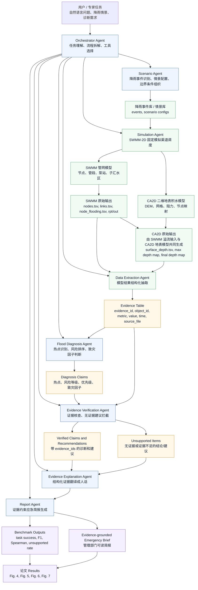

# SWMM-2D-Agentic 论文 Agent 协同工作逻辑图 V2

本版相对上一版做了两处调整：

1. 将 `CA2D 原始输出` 表达为由 `SWMM 原始输出` 和 `CA2D 二维地表积水模型` 共同生成，避免误解为 CA2D 输出只来自二维模型自身。
2. 将 `SWMM-2D 固定模拟管线调度` 改为 `SWMM-2D 固定模拟渠道调度`，避免审稿老师将“管线”误解为排水管网中的管线/管段。

## Agent 协同逻辑图



## 调整后的关键逻辑说明

### 1. CA2D 输出不是孤立产生的

CA2D 二维地表积水结果并不是只由 CA2D 静态模型独立生成，而是由两类输入共同决定：

- `SWMM 原始输出`：尤其是节点溢流时序、溢流量、溢流节点位置。
- `CA2D 二维地表积水模型`：包括 DEM、网格、阻力、建筑/流动掩膜、节点到网格的映射。

因此图中将 `SWMM 原始输出` 和 `CA2D 二维地表积水模型` 同时连接到 `CA2D 原始输出`，表达的是：

```text
SWMM 节点溢流边界 + CA2D 地表传播模型 -> 二维积水深度、范围和持续时间
```

这个表达更符合水动力耦合逻辑。

### 2. “固定模拟渠道调度”比“固定模拟管线调度”更稳妥

原来的“固定模拟管线调度”容易与排水管网中的“管线/管段”概念混淆。新图改成“固定模拟渠道调度”，强调的是 Agent 调用一条经过验证的模拟执行渠道：

```text
降雨事件写入 SWMM
-> PySWMM 运行
-> 导出节点溢流
-> CA2D 二维积水计算
-> 保存 runs 结果
```

这里的“渠道”不是水力管线，而是系统执行路径或任务通道。若后续觉得“渠道”仍然不够学术，也可以改成：

- 固定模拟流程调度
- 固定模拟路径调度
- 标准化模拟流程调度
- 标准模拟工作流调度

其中，面向论文审稿，我最推荐 `标准化模拟流程调度`。

