# SWMM-2D-Agentic 论文 Agent 协同工作逻辑图 V3

本版采用“模块内纵向、模块间横向”的布局，以避免上一版纵向图过长。图中将整个系统分为五个大模块：

1. 任务编排模块。
2. 模型计算模块。
3. 证据构建模块。
4. 诊断与核查模块。
5. 解释、报告与评价模块。

同时，本版将 `SWMM-2D 固定模拟渠道调度` 进一步修改为：

```text
SWMM-2D 标准化模拟流程调度
```

这个表述更适合论文审稿语境，也避免“管线”与排水管网中的管线/管段混淆。

## Agent 协同逻辑图

```mermaid
flowchart LR
    subgraph M1["任务编排模块"]
        direction TB
        U["用户 / 专家任务<br/>自然语言问题、降雨情景、诊断需求"] --> O["Orchestrator Agent<br/>任务理解、流程拆解、工具选择"]
        O --> SCA["Scenario Agent<br/>降雨事件识别、情景配置、边界条件组织"]
        O --> SIM["Simulation Agent<br/>SWMM-2D 标准化模拟流程调度"]
    end

    subgraph M2["模型计算模块"]
        direction TB
        RF["降雨事件库 / 情景库<br/>events, scenario configs"] --> SIM_IN["模拟输入组织"]
        SWMM["SWMM 管网模型<br/>节点、管段、泵站、子汇水区"] --> SWMM_OUT["SWMM 原始输出<br/>nodes.tsv, links.tsv, node_flooding.tsv, rpt/out"]
        CA2D["CA2D 二维地表积水模型<br/>DEM、网格、阻力、节点映射"] --> CA2D_OUT["CA2D 原始输出<br/>由 SWMM 溢流输入与 CA2D 地表模型共同生成<br/>surface_depth.tsv, max depth map, final depth map"]
        SIM_IN --> SWMM
        SWMM_OUT --> CA2D_OUT
    end

    subgraph M3["证据构建模块"]
        direction TB
        EXT["Data Extraction Agent<br/>模型结果结构化抽取"] --> EVID["Evidence Table<br/>evidence_id, object_id, metric, value, time, source_file"]
        EVID --> SUM["Scenario Summary<br/>run_id、event、scenario、关键统计指标"]
    end

    subgraph M4["诊断与核查模块"]
        direction TB
        DIA["Flood Diagnosis Agent<br/>热点识别、风险排序、致灾因子判断"] --> CLAIMS["Diagnosis Claims<br/>热点、风险等级、优先级、致灾因子"]
        CLAIMS --> VER["Evidence Verification Agent<br/>证据核查、无证据建议拦截"]
        VER --> VERIFIED["Verified Claims and Recommendations<br/>带 evidence_ids 的诊断和建议"]
        VER --> UNSUP["Unsupported Items<br/>无证据或证据不足的结论/建议"]
    end

    subgraph M5["解释、报告与评价模块"]
        direction TB
        EXP["Evidence Explanation Agent<br/>结构化证据翻译成人话"] --> REP["Report Agent<br/>证据约束应急简报生成"]
        REP --> BRIEF["Evidence-grounded Emergency Brief<br/>管理部门可读简报"]
        REP --> BENCH["Benchmark Outputs<br/>task success, F1, Spearman, unsupported rate"]
        BRIEF --> PAPER["论文 Results<br/>Fig. 4, Fig. 5, Fig. 6, Fig. 7"]
        BENCH --> PAPER
    end

    SCA --> RF
    SIM --> SIM_IN
    SWMM_OUT --> EXT
    CA2D_OUT --> EXT
    EVID --> DIA
    EVID --> VER
    VERIFIED --> EXP
    UNSUP --> EXP
```



## 模块间逻辑

### 1. 任务编排模块

该模块负责将用户的自然语言任务转化为可执行流程。Orchestrator Agent 不直接执行水动力计算，而是判断任务需要哪些模型、工具和后续 Agent。

### 2. 模型计算模块

该模块负责确定性模拟。`SWMM-2D 标准化模拟流程调度` 表达的是一条经过验证的执行流程：

```text
降雨事件与情景配置
-> 写入 SWMM 输入
-> 运行 SWMM
-> 导出节点溢流
-> 驱动 CA2D 二维地表积水模型
-> 输出二维积水结果
```

图中特别强调：`CA2D 原始输出` 由 `SWMM 原始输出` 和 `CA2D 二维地表积水模型` 共同生成。

### 3. 证据构建模块

该模块将散乱的 SWMM 与 CA2D 输出统一为 evidence table。后续所有诊断、核查和报告都应引用 evidence table，而不是让 LLM 临时读取零散文件自由解释。

### 4. 诊断与核查模块

Flood Diagnosis Agent 负责生成热点、风险等级、优先级和致灾因子判断。Evidence Verification Agent 负责核查这些诊断和建议是否有证据支撑，并标记 unsupported items。

### 5. 解释、报告与评价模块

Evidence Explanation Agent 将结构化证据翻译成自然语言。Report Agent 生成应急简报和论文案例材料。Benchmark 输出用于量化 Agent 的任务成功率、诊断准确性、风险排序一致性和无证据建议比例。

